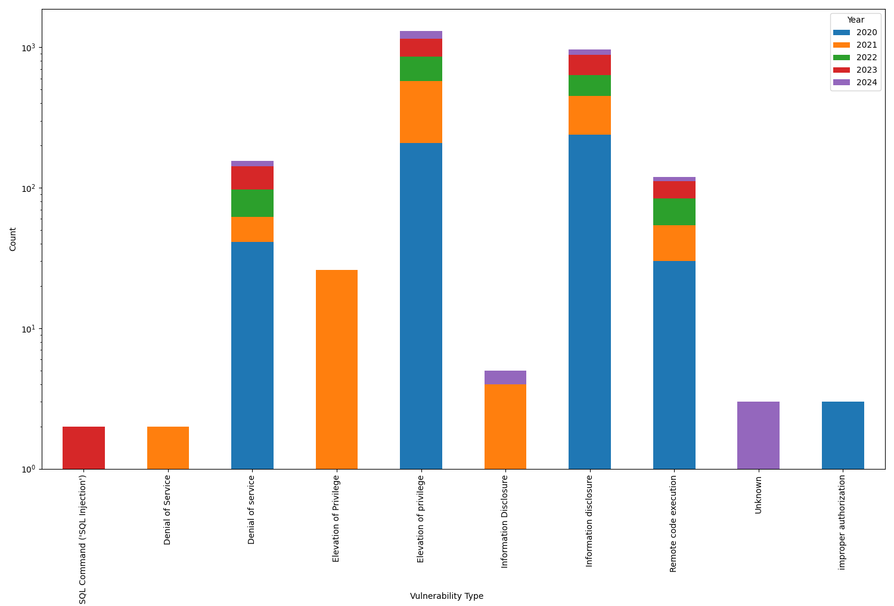
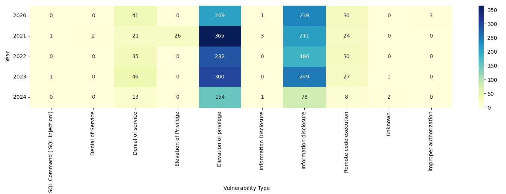

# CVE List V5 Visualization

This Python script is designed to analyze vulnerabilities associated with specific products by plotting data from CVE LIST v5 JSON files.

## Available Plots - 
1. Top 10 vulnerabilities vs count per year stacked bar graph _(example for "Android")_

2. Top 10 vulnerability per year heatmap _(example for "Android")_

## How to use

### Get the code

```shell
git clone --recursive https://github.com/Saket-Upadhyay/CVEViz.git
```
This will also fetch the latest version of [CVEListV5](https://github.com/CVEProject/cvelistV5/tree/main)

### Get requirements

```shell
cd CVEViz
pip3 install -r requirements.txt
```

### Change targets

Change the variables in `targets.py`, for example, to target Android from 2020 to 2024 -

```python
FROM_YEAR = 2020
TO_YEAR = 2024
PRODUCTS = ["Android"]
```

### Generate plots

```shell
python3 main.py ./cvelistV5/cves/
```

Generated plots will be saved as `{PRODUCTS[0]}-top10-{stackbar/heatmap}-{FROM_YEAR}-{TO_YEAR}.png`.

E.g.: `android-top10-heatmap-2018-2024.png`
